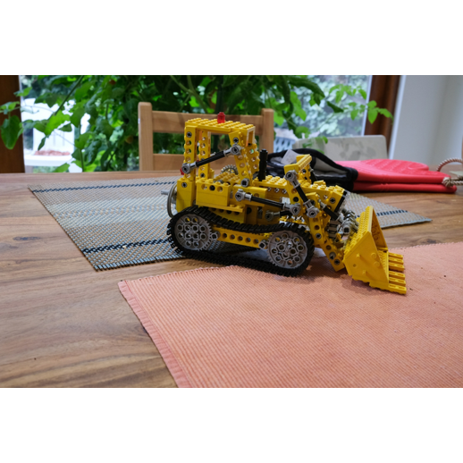
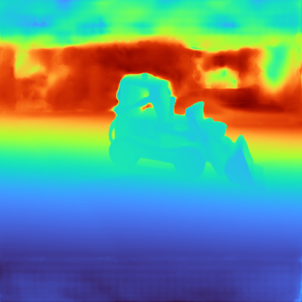
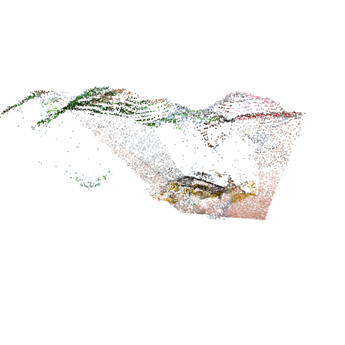

# tt-vggt

VGGT-1B (`facebookresearch/vggt`) on a single Tenstorrent Blackhole
p150a via `tt-nn` / `tt-metallium`.

## Results at a glance

| | torch CPU reference | ttnn port on p150a | ratio |
|---|---|---|---|
| latency / frame (B=1 S=1 518×518) | 5037 ms | **~1694 ms** | **2.97×** |
| throughput | 0.1985 fps | **0.59 fps** | **+196 %** |
| min-PCC (port vs ref, synthetic input) | — | 0.9959 | — |
| min-PCC (port vs ref, real CO3Dv2 apple) | — | **0.9947** | — |
| AUC@30° (CO3Dv2 apple S=2, 3 scenes) | 87.2 | **86.1** | Δ −1.1 |

## Demos

Single-image inference on `vggt_ref/examples/kitchen/images/00.png` via
`make_demo.py`. Depth map and re-rendered point cloud are both produced
from the ttnn port's `depth` and `world_points` outputs.

| input | predicted depth | point cloud, rendered from a new angle |
|---|---|---|
|  |  |  |

Reproduce with:

```bash
python3 make_demo.py
```

## Repository layout

```
tt-vggt/
├── README.md
├── TODO.md                  # future bug-fix + optimization plan
├── co3d_eval_results.md     # detailed CO3Dv2 eval write-up
├── results.tsv              # one row per experiment
├── test_vggt.py             # perf benchmark harness (B=1 S=1)
├── eval_vggt.py             # CO3Dv2 correctness harness (PCC + GT pose)
├── make_demo.py             # populates media/ with input + depth + point cloud
├── media/                   # demo input + output images
└── models/demos/vggt/
    ├── reference/torch_vggt.py    # loader over facebookresearch/vggt
    └── tt/ttnn_vggt.py            # ttnn port
```

## How to reproduce

### 1. Clone and set up paths

```bash
git clone https://github.com/changh95/tt-vggt.git
cd tt-vggt

# Clone the VGGT reference repo alongside (for torch CPU reference).
git clone --depth 1 https://github.com/facebookresearch/vggt.git vggt_ref

# Download the 1B weights into the HF cache.
source ~/.tenstorrent-venv/bin/activate
python3 -c "from huggingface_hub import hf_hub_download; \
    hf_hub_download(repo_id='facebook/VGGT-1B', filename='model.safetensors')"
```

The harnesses import `ttnn` via `sys.path` from
`/home/ttuser/experiments/medgemma/tt-metal` — adjust `_TT_METAL_ROOT`
at the top of each harness to point at your own tt-metal checkout.

### 2. Benchmark

```bash
python3 test_vggt.py --runs 3 --seq 1 --device-id 0
```

Expected (this commit): `latency_ms: ~1700`, `pcc: ~0.996`, `status: PASS`.

### 3. Correctness on CO3Dv2

```bash
# Download one single-sequence apple chunk (~190 MB of images + 120 KB annotations).
mkdir -p co3d_data && cd co3d_data
curl -sSL https://dl.fbaipublicfiles.com/co3dv2_231130/apple_000_singlesequence.zip -o apple_000.zip
curl -sSL https://dl.fbaipublicfiles.com/co3dv2_231130/apple_001_singlesequence.zip -o apple_001.zip
unzip -q apple_000.zip && unzip -q apple_001.zip
cd ..

python3 eval_vggt.py --num-views 2 --category apple --co3d-root co3d_data
```

See `co3d_eval_results.md` for the full write-up.

## Precision profile

Preserved unchanged through every keep commit below:

- bf16 weights, bf16 matmul inputs.
- fp32 residual accumulator inside each Block (proj/fc2 output
  `dtype=float32`). bf16 residuals over 48 aggregator blocks collapsed
  `world_points_conf` PCC to 0.978.
- fp32 attention scores + softmax + context via HiFi4 + `dtype=float32`.
  bf16 softmax over 1374-long rows dropped conf PCC below 0.99.
- HiFi4 + `fp32_dest_acc_en=True` on proj / fc2 / DPT `output_conv2`.

## PCC tests

"Relative" PCC: Pearson correlation between the torch CPU reference
output and the ttnn port output, per output channel. Threshold for
`status: PASS` is min-channel PCC ≥ 0.99.

### Synthetic input (`torch.rand(1, 1, 3, 518, 518)`)

```
pcc_pose_enc          = 1.0000
pcc_depth             = 1.0000
pcc_depth_conf        = 0.9997
pcc_world_points      = 1.0000
pcc_world_points_conf = 0.9959    <- min, above 0.99 floor
```

### Real CO3Dv2 images (apple / 3 scenes / S=2)

```
mean pcc_pose_enc          = 0.9999
mean pcc_depth             = 0.9947
mean pcc_depth_conf        = 0.9985
mean pcc_world_points      = 0.9999
mean pcc_world_points_conf = 0.9996
```

Per-scene breakdown is in `co3d_eval_results.md`. The conf channels —
which were the bf16-stress bottleneck during porting — stay well above
0.99 on natural-image inputs.

## CO3Dv2 ground-truth evaluation

Pair-wise relative poses, 3 single-sequence apple scenes, S=2 (1 pair
each, 3 pairs total). GT viewpoints converted from CO3D PyTorch3D
convention to OpenCV via `diag(-1, -1, 1) @ R.T` on the rotation.

|  | RRA@5° | RRA@15° | RTA@5° | RTA@15° | **AUC@30°** |
|---|---:|---:|---:|---:|---:|
| torch reference | 0.0 % | 100.0 % | 66.7 % | 100.0 % | **87.2** |
| ttnn port | 33.3 % | 100.0 % | 66.7 % | 100.0 % | **86.1** |
| Δ (port − ref) | +33.3 | +0.0 | +0.0 | +0.0 | **−1.1** |

Port costs ≈1.1 AUC@30° points against the torch reference on real data.
That's the honest quantization bill for the 3× speedup. The +33.3 % on
RRA@5° is a 3-pair-sample artefact, not signal (one extra pair below
5° flips the fraction by 33 %).

Scaling up to more views per scene and more categories is **blocked** by
a ttnn kernel-compile-on-first-new-shape stall at S>2 (documented in
`TODO.md` as BF0). S=2 / 3 pairs is statistically coarse but was enough
to measure the port's bf16+HiFi4 cost against the reference.

## Optimization trajectory

Every row an experiment run on the p150a. `keep` means the commit landed
on `changh95/vggt`; `discard` means it was reverted or never merged.
Latency is best-of-3 `latency_ms` at B=1 S=1 518×518. Full log with
every noise-level experiment in `results.tsv`.

| # | commit | status | change | ms | fps | min PCC | note |
|---|---|---|---|---:|---:|---:|---|
| 1 | c7d238e | keep | scaffolding | — | — | — | empty stubs |
| 2 | f718b74 | keep | CPU passthrough baseline | 5037 | 0.1985 | 1.0000 | reference |
| 3 | f718b74 | discard | `torch.set_num_threads(16)` | 7064 | 0.1416 | 1.0000 | HT oversubscription |
| 4 | 185868f | **keep** | port MLP (72× fc1+gelu+fc2 bf16) | 3122 | 0.3203 | 0.9948 | +61 % |
| 5 | 185868f | discard | port every `nn.Linear` | — | 0.2898 | 0.986 | tiny head linears: overhead + precision |
| 6 | 185868f | discard | MLP + attn qkv + proj (bf16 proj) | — | 0.4028 | 0.988 | bf16 proj breaks conf |
| 7 | b311533 | **keep** | attn qkv on ttnn (proj stays CPU) | 2669 | 0.3746 | 0.9930 | +17 % |
| 8 | b311533 | discard | standalone `Block.norm1/2` LN on device | +100 | 0.3608 | 0.9944 | LN compute < round-trip |
| 9 | 0a04e6f | **keep** | attn proj, HiFi4 + fp32 dest | 2495 | 0.4008 | 0.9955 | HiFi4 restored proj precision |
| 10 | 0a04e6f | discard | top-level bf16 autocast | — | 0.4272 | **0.0000** | heads need fp32 tokens |
| 11 | 0a04e6f | discard | fused `ttnn.SDPA` (LoFi) | — | 0.4341 | 0.979 | kernel precision loss |
| 12 | 0a04e6f | discard | fused `ttnn.SDPA` (HiFi4) | — | 0.4932 | **0.572** | likely ttnn shape bug for non-causal 1374 |
| 13 | 0a04e6f | discard | manual Q·Kᵀ+softmax+·V all bf16 on device | — | 0.4615 | 0.979 | bf16 softmax precision |
| 14 | 53d46c1 | **keep** | full attention on device, fp32 scores+softmax | 2232 | 0.4481 | 0.9943 | +12 % |
| 15 | 53d46c1 | discard | `nlp_create_qkv_heads` split, keep V on device | 2232 | 0.4481 | 0.9943 | break-even |
| 16 | 9c7d71a | **keep** | fuse `Block.norm1` into attn on device | 2193 | 0.4559 | 0.9955 | +2 % |
| 17 | a86d4aa | **keep** | keep qkv bf16 through CPU path (skip fp32 cast) | 2067 | 0.4837 | 0.9946 | +6 % |
| 18 | a86d4aa | discard | `torch.set_num_threads(4)` | 2428 | 0.4119 | 0.9946 | CPU glue benefits from more threads |
| 19 | ffd157c | discard | bf16 autocast over `DPTHead.forward` | — | 0.5393 | **0.0000** | `expp1` conf activation too sensitive |
| 20 | ffd157c | discard | DPT `norm` + `projects` 1×1 on device | 2131 | 0.4691 | 0.9957 | prelude too small for roundtrip |
| 21 | 8969cef | **keep** | full on-device Block (norm1, qkv, qk_norm, scores/softmax/ctx, merge_heads, proj, ls1, add, norm2, fc1+gelu+fc2, ls2, add) | 1712 | 0.5841 | 0.9961 | +194 %, biggest single step |
| 22 | bae1d60 | **keep** | 2D RoPE on device (cos/sin tables + rotate_half + mul/add) | 1640 | 0.6097 | 0.9957 | +207 %, q/k no longer leave chip |
| 23 | db0ff6a | **keep** | DPT `output_conv2` (3×3 → relu → 1×1 at 518×518) on `ttnn.conv2d` | ~1694 | 0.5900 | 0.9959 | break-even wall-clock; ~454 ms CPU → device |
| 24 | db0ff6a | discard | per-conv wrapper for DPT `scratch_forward` | 1895 | 0.5276 | 0.9960 | 120× up/down round-trips dominate |
| 25 | 2b2bf2d | discard | device-native `scratch_forward` refinenets | 1418 | 0.7053 | **−0.0754** | ttnn layout-chaining bug; fix via mast3r helpers (see TODO) |

**Principles extracted from this trajectory:**

- **Always validate against a *fresh un-patched* reference.**
  `eval_vggt.py` loads a separate VGGT instance; otherwise the port
  compares against itself and every experiment looks like PCC 1.0.
- **Precision budget is cumulative, not per-op.** Each bf16 op was fine
  alone but stacking them blew the 0.99 conf-head floor twice. Targeted
  fp32 intermediates (residual accumulator, softmax) recovered the
  budget without paying fp32's bandwidth cost globally.
- **Host↔device round-trip beats compute for small ops.** LayerNorm
  alone, prelude 1×1 convs, per-conv wrappers — all net-negative
  because 72 × (upload + download) per forward outruns the chip's
  compute savings. The wins came from fused functions that upload once,
  compute many ops, download once.
- **`MathFidelity.HiFi4` + `fp32_dest_acc_en` on precision-hot matmuls**
  is the cheapest precision lever. It flipped the attn proj port from
  FAIL (0.988) to PASS (0.996) without changing wall-clock.

## Known limitations

Full backlog is in `TODO.md`. Highlights:

- **S > 2 compile stall** (BF0): first forward at a new sequence length
  hangs for 20+ min due to ttnn kernel-compile-on-first-new-shape.
  Blocks deeper CO3D eval. Fix candidates: pre-warm cache at install,
  pad to canonical S, or pre-specify matmul program_config.
- **Device wedges on hard-kill** (BF1): `kill -9` of a ttnn process
  leaves chip 0 with ETH heartbeat stuck, requires `tt-smi -r 0 1 2 3`
  to recover. Need a SIGTERM/SIGINT handler in the harnesses.
- **3×3 convs in the DPT refinenets** are still on CPU (~388 ms of the
  1700 ms total). The port attempt broke on ttnn layout chaining; fix
  is to copy mast3r's `_conv2d`/`_resconv`/`_tokens_to_nhwc` helpers
  verbatim (see P0 in TODO).
- **CPU-pinned glue** (image normalization, token concatenation,
  activate_head) remains, mostly for numerical reasons
  (`activate_head`'s `expp1` is precision-sensitive). Small wins
  individually.

## Credits

- **VGGT model**: Meta AI, `facebookresearch/vggt`, Apache 2.0.
- **Tenstorrent SDK** (`tt-metal`, `tt-nn`): Tenstorrent, Apache 2.0.
- **Sibling `mast3r` port** on the same hardware provided the ttnn
  layout-handling pattern reference
  (`/home/ttuser/experiments/mast3r/tt-metal/models/demos/mast3r/`).

## License

Apache 2.0 — same as upstream VGGT and tt-metal.
