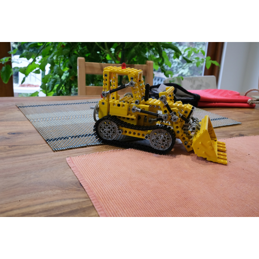
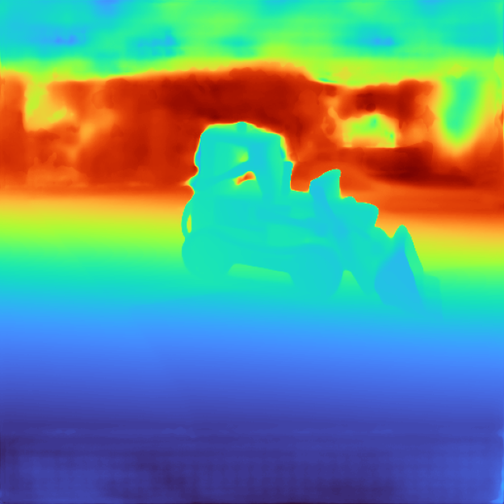
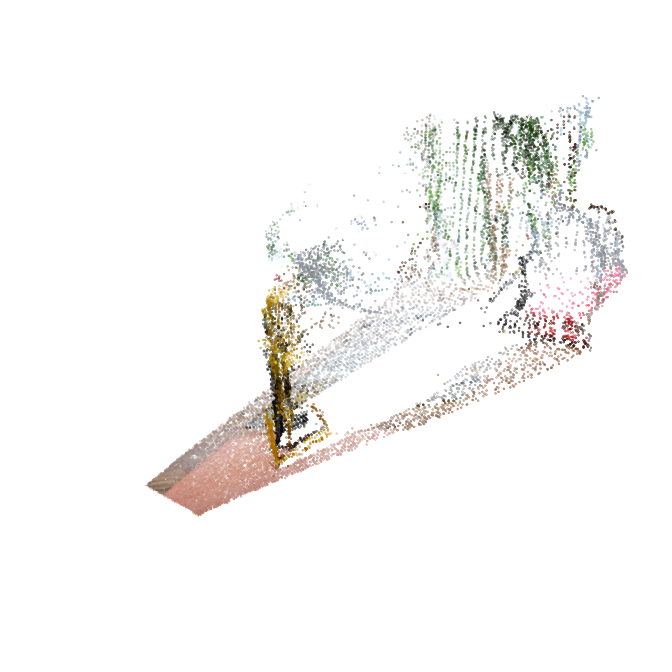

# tt-vggt

VGGT-1B (`facebookresearch/vggt`) on a single Tenstorrent Blackhole
p150a via `tt-nn` / `tt-metallium`.

## Results at a glance

Two device paths share one code base. `TT_FUSED=1` (the **default**) runs
the whole forward device-resident and replays one metal trace per view
count; `TT_FUSED=0` restores the original monkey-patch port ("legacy")
bit for bit. Device numbers below were measured 2026-09-13 on one p150a
with tt-metal `v0.78.0-dev20260820` (`8b98410e730`); the full record is
`DEVICE_VALIDATION.md` (section "Results (device, 2026-09-13)").

| | torch CPU reference | legacy path (`TT_FUSED=0`) | traced path (default) |
|---|---|---|---|
| latency / frame, served over HTTP (warm S=1, 30 requests, median forward · total) | 5037 ms (port author's CPU) | 1602 · 1717 ms | **411 · 526 ms** |
| latency, served S=2 (10 requests, median forward) | — | 2887 ms | **881 ms** |
| latency, `test_vggt.py` best-of-3, S=1 / 2 / 3 / 4 | — | 1322 / 2314 / 4075 / 5748 ms | **406 / 874 / 1945 / 2759 ms** |
| min-PCC (port vs ref, synthetic input) S=1 / 2 / 3 / 4 | — | 0.9950 / 0.9991 / 0.9978 / 0.9975 | 0.9952 / 0.9981 / 0.9984 / 0.9979 |
| min-PCC (port vs ref, 7 real scenes S=1..3, mean / worst) | — | 0.99903 / 0.99791 | 0.99887 / 0.99772 |
| served fused vs served legacy outputs | — | reference | PCC ≥ 0.9997 on every output key |
| AUC@30° (CO3Dv2 apple S=2, 3 scenes; port author, legacy path) | 87.2 | **86.1** (Δ −1.1) | not re-measured (CO3D data was not on the validation host) |

The traced path is 3.9× faster than the legacy path at S=1 served
(1602 → 411 ms) and 3.3× at S=2, and stays within 0.001 min-PCC of the
legacy path at every S on synthetic input and within 0.0002 on the
real-image set. The "throughput +196 %" and "~1694 ms" figures of the
original write-up were the legacy path on the port author's host; the
legacy column above is the same code re-measured on the validation host.

## Demos

Single-image inference on `vggt_ref/examples/kitchen/images/00.png` via
`make_demo.py`. Depth map and re-rendered point cloud are both produced
from the ttnn port's `depth` and `world_points` outputs.

| input | predicted depth | point cloud, rendered from a new angle |
|---|---|---|
|  |  |  |

Reproduce with (paths: see *How to reproduce*):

```bash
TT_METAL_HOME=/path/to/tt-metal VGGT_REF=$PWD/vggt_ref python3 make_demo.py
# TT_FUSED=0 renders the same demo through the legacy path.
```

## Repository layout

```
tt-vggt/
├── README.md
├── TODO.md                  # future bug-fix + optimization plan
├── DEVICE_VALIDATION.md     # 2026-09-13 p150a validation of the traced path: plan, gates, measured results, knob table
├── co3d_eval_results.md     # detailed CO3Dv2 eval write-up
├── results.tsv              # one row per experiment (legacy trajectory + traced-path A/Bs)
├── test_vggt.py             # perf benchmark harness (B=1, S=1..4)
├── eval_vggt.py             # CO3Dv2 correctness harness (PCC + GT pose)
├── make_demo.py             # populates media/ with input + depth + point cloud
├── profile_tracy.sh         # Tracy op profile of test_vggt.py
├── media/                   # demo input + output images
└── models/
    ├── demos/vggt/
    │   ├── reference/torch_vggt.py    # loader over facebookresearch/vggt
    │   └── tt/
    │       ├── ttnn_vggt.py           # entry points (`_ensure_installed`, `vggt_forward`,
    │       │                          #   `release_device_state`) + the legacy monkey-patch port
    │       ├── ttnn_vggt_fused.py     # TT_FUSED=1: device-resident `TtVggt`, one metal trace per S
    │       └── fused_tables.py        # torch-only knob parsing, constant tables, exact reformulations
    └── tests/
        ├── test_fused_host.py         # torch-only proofs of the reformulations + knob plumbing (no device)
        ├── test_fused_graph_dryrun.py # whole device graph on a fake ttnn (shape rules, use-after-free)
        └── fake_ttnn.py               # the fake ttnn used by the dry run
```

## How to reproduce

### 1. Clone and set up paths

```bash
git clone https://github.com/changh95/tt-vggt.git
cd tt-vggt

# Clone the VGGT reference repo alongside (for torch CPU reference).
git clone --depth 1 https://github.com/facebookresearch/vggt.git vggt_ref

# Download the 1B weights into the HF cache.
source ~/.tenstorrent-venv/bin/activate
python3 -c "from huggingface_hub import hf_hub_download; \
    hf_hub_download(repo_id='facebook/VGGT-1B', filename='model.safetensors')"
```

The harnesses add three roots to `sys.path`: the repo itself (so
`models.demos.vggt.*` imports resolve), `$TT_METAL_HOME` (a built
tt-metal checkout providing `ttnn`) and `$VGGT_REF` (the upstream
`vggt` package, if it is not already importable). Set them once:

```bash
export TT_METAL_HOME=/path/to/tt-metal      # built tree; its python_env has ttnn + torch
export VGGT_REF=$PWD/vggt_ref               # the clone from step 1
export TT_DEVICE_ID=0                       # default chip; --device-id overrides
```

The device is opened by the harnesses with the settings the active path
needs: `l1_small_size` 32 KiB and no trace region with `TT_FUSED=0`,
64 KiB (`VGGT_L1_SMALL_KB`) plus a 1536 MiB trace region
(`VGGT_TRACE_REGION_MB`) with the default traced path.

### 2. Benchmark

```bash
# traced path (default): one trace per S, captured at install
python3 test_vggt.py --runs 3 --seq 1 --device-id 0
python3 test_vggt.py --runs 3 --seq 2 --prewarm-seqs 1,2   # several S warm at once

# legacy path, bit for bit the original port
TT_FUSED=0 python3 test_vggt.py --runs 3 --seq 1 --device-id 0
```

Measured 2026-09-13 (best-of-3, synthetic input; `DEVICE_VALIDATION.md`
"Gates"): traced path `latency_ms: 406`, `pcc: 0.9952`, `status: PASS`
at S=1 (874 / 0.9981 at S=2, 1945 / 0.9984 at S=3, 2759 / 0.9979 at
S=4); legacy path `latency_ms: 1322`, `pcc: 0.9950` at S=1. On a cold
kernel cache the traced path's S=1 warm run took ~46 s of JIT before
the first timed run (a warm cache boots in ~30 s served).
`--prewarm-seqs 1,2,3,4` (or `VGGT_S_CANON=4`) captures one trace per
view count at install so no S compiles at request time.

### 3. Correctness on CO3Dv2

```bash
# Download one single-sequence apple chunk (~190 MB of images + 120 KB annotations).
mkdir -p co3d_data && cd co3d_data
curl -sSL https://dl.fbaipublicfiles.com/co3dv2_231130/apple_000_singlesequence.zip -o apple_000.zip
curl -sSL https://dl.fbaipublicfiles.com/co3dv2_231130/apple_001_singlesequence.zip -o apple_001.zip
unzip -q apple_000.zip && unzip -q apple_001.zip
cd ..

python3 eval_vggt.py --num-views 2 --category apple --co3d-root co3d_data
```

See `co3d_eval_results.md` for the full write-up. The CO3Dv2 numbers in
this README are the port author's legacy-path run; `eval_vggt.py` runs
the traced path by default (`TT_FUSED=0` for the legacy path) but has
not been re-run on CO3D since the traced path landed.

### 4. Host tests (no device, no `ttnn`)

```bash
# torch-only proofs of every exact reformulation the device graph relies on,
# plus the knob plumbing (28 tests together with the dry run, 2026-09-13)
VGGT_REF=$PWD/vggt_ref python3 -m pytest models/tests/test_fused_host.py -q

# whole TtVggt device graph on a fake ttnn: shape rules, per-S trace bookkeeping,
# use-after-free tracking, every knob combination (needs ~1.2 GB host RAM)
VGGT_REF=$PWD/vggt_ref python3 -m pytest models/tests/test_fused_graph_dryrun.py -q
```

Both files also run as plain scripts (`python3 models/tests/test_fused_host.py`).
Tests that need the upstream `vggt` package skip when `VGGT_REF` is unset.

## The `TT_FUSED` knob

`TT_FUSED` is read **once**, when `_ensure_installed` runs against the
open device (never per forward):

- `TT_FUSED=1` (**default**, also when unset or empty): `vggt_forward` is
  served by the device-resident `TtVggt` wrapper in
  `models/demos/vggt/tt/ttnn_vggt_fused.py`. Weights, RoPE tables and
  masks live on the device, every ttnn call between the token upload and
  the two head readbacks is captured into one metal trace per S and
  replayed with `execute_trace`. The fp32 residual stream never leaves
  the chip, the 4 aggregator concats, the camera head and both DPT heads
  (one frame at a time, S=1 shapes) run in-graph; the host keeps the
  DINOv2 patch embedding, `activate_head` and `activate_pose`.
- `TT_FUSED=0` (or `false` / `no` / `off`): the legacy class-level
  monkey-patch port in `ttnn_vggt.py` runs unchanged. Every change to the
  shared files is additive and inert with the knob off; the served
  legacy outputs were byte-identical before and after the flip.

The track head (`query_points`) is not part of the device graph and
raises `NotImplementedError` on the traced path.

Per-stage knobs (`VGGT_FUSED_<NAME>`, read once with `TT_FUSED=1`; the
default of each is the configuration that passed the accuracy gates in
`DEVICE_VALIDATION.md`):

| knob | default | alternatives | measured (S=1 unless noted) |
|---|---|---|---|
| `VGGT_FUSED_INTERP` | `exact` (0/1 bf16 gathers of a bf16 hi/lo split + fp32 eltwise weights = host fp32 `F.interpolate`) | `rep` (one fp32×fp32 matmul per pass, tf32-class rounding) · `flat` · `bcast` | `exact` 406 ms / 0.9952; `rep` 369 ms / 0.9935 (−0.0015 synthetic, ±0.0002 on real images); `bcast` **hangs** this tree |
| `VGGT_FUSED_RESHAPE` | `rm` (untilize → row-major view → tilize) | `tiled` (`reshape_tiled` + `fill_pad`) | `rm` saves ~5 ms per 518² relayout, bit-identical: 448 → 406 ms |
| `VGGT_FUSED_ATTN` | `matmul` (fp32 scores + softmax + context) | `sdpa` (flash attention, bf16 probabilities) | `sdpa` 243 ms / 0.9957 synthetic, S=4 980 ms, but real-image mean 0.99793 / worst 0.99488 (depth_conf −0.0027) → kept as a knob, not the default |
| `VGGT_FUSED_MATMUL` | `linear` | `minimal` (`minimal_matmul` kernels) | 372 ms / 0.9984 synthetic, no speed gain |
| `VGGT_FUSED_SOFTMAX` | `legacy` (decomposed fp32 softmax at N ≥ `VGGT_FUSED_LARGE_SOFTMAX_N`=4000) | `inplace` · `scale_mask` | no hang at N=4122, 0.9987 at S=3 eager; superseded by `sdpa` for speed |
| `VGGT_FUSED_CAMERA` | `device` (4 refinement iterations in-graph) | `host` (one readback + torch camera head) | `host` +214 ms, `pose_enc` identical |
| `VGGT_FUSED_LN32` | `kernel` (fp32 `ttnn.layer_norm`) | `eltwise` (fp32 eltwise decomposition) | +0.0002 PCC, +1 ms |
| `VGGT_FUSED_PRELUDE` | `bf16` | `fp32` | `fp32` 0.9916 (worse) |
| `VGGT_FUSED_OC2_FP32` | `0` | `1` | 0.9935 (worse) |
| `VGGT_FUSED_TRACE` | `multi` (one trace per S, all live) | `ondemand` (one trace at a time) · `off` (eager device graph) | eager == traced within noise (the graph is device-bound) |
| `VGGT_FUSED_INPUT` / `VGGT_FUSED_GATHER` | `rowmajor` / `matmul` | `tile` / `slice` | layout plumbing, no accuracy effect |
| `VGGT_FUSED_LOG` | `1` (warm-up / capture lines) | `0` quiet · `2` per-stage synchronized timing (eager only) | — |
| `VGGT_FUSED_MM_BLOCKS`, `VGGT_FUSED_SDPA_CHUNKS` | `8,4,4,2,2` / `128,256` | tile block sizes for `minimal` / `sdpa` | — |
| `VGGT_TRACE_REGION_MB`, `VGGT_L1_SMALL_KB` | `1536` / `64` | device-open sizes on the traced path (legacy: none / 32) | four traces (S=1..4) take 15.8 MiB per bank of the region |
| `VGGT_S_CANON`, `--prewarm-seqs` | `1` | `N` = warm and capture S = 1..N at install | S=1..4 all captured and cross-S bit-identical |

Unknown values raise at install (`RuntimeError`), nothing is guessed.

## Precision profile

Preserved unchanged through every keep commit below:

- bf16 weights, bf16 matmul inputs.
- fp32 residual accumulator inside each Block (proj/fc2 output
  `dtype=float32`). bf16 residuals over 48 aggregator blocks collapsed
  `world_points_conf` PCC to 0.978.
- fp32 attention scores + softmax + context via HiFi4 + `dtype=float32`.
  bf16 softmax over 1374-long rows dropped conf PCC below 0.99.
- HiFi4 + `fp32_dest_acc_en=True` on proj / fc2 / DPT `output_conv2`.

## PCC tests

"Relative" PCC: Pearson correlation between the torch CPU reference
output and the ttnn port output, per output channel. Threshold for
`status: PASS` is min-channel PCC ≥ 0.99.

### Synthetic input (`torch.rand(1, 1, 3, 518, 518)`)

```
pcc_pose_enc          = 1.0000
pcc_depth             = 1.0000
pcc_depth_conf        = 0.9997
pcc_world_points      = 1.0000
pcc_world_points_conf = 0.9959    <- min, above 0.99 floor
```

### Real CO3Dv2 images (apple / 3 scenes / S=2)

```
mean pcc_pose_enc          = 0.9999
mean pcc_depth             = 0.9947
mean pcc_depth_conf        = 0.9985
mean pcc_world_points      = 0.9999
mean pcc_world_points_conf = 0.9996
```

Per-scene breakdown is in `co3d_eval_results.md`. The conf channels —
which were the bf16-stress bottleneck during porting — stay well above
0.99 on natural-image inputs.

## CO3Dv2 ground-truth evaluation

Pair-wise relative poses, 3 single-sequence apple scenes, S=2 (1 pair
each, 3 pairs total). GT viewpoints converted from CO3D PyTorch3D
convention to OpenCV via `diag(-1, -1, 1) @ R.T` on the rotation.

|  | RRA@5° | RRA@15° | RTA@5° | RTA@15° | **AUC@30°** |
|---|---:|---:|---:|---:|---:|
| torch reference | 0.0 % | 100.0 % | 66.7 % | 100.0 % | **87.2** |
| ttnn port | 33.3 % | 100.0 % | 66.7 % | 100.0 % | **86.1** |
| Δ (port − ref) | +33.3 | +0.0 | +0.0 | +0.0 | **−1.1** |

Port costs ≈1.1 AUC@30° points against the torch reference on real data.
That's the honest quantization bill for the 3× speedup. The +33.3 % on
RRA@5° is a 3-pair-sample artefact, not signal (one extra pair below
5° flips the fraction by 33 %).

Scaling up to more views per scene and more categories is **blocked** by
a ttnn kernel-compile-on-first-new-shape stall at S>2 (documented in
`TODO.md` as BF0). S=2 / 3 pairs is statistically coarse but was enough
to measure the port's bf16+HiFi4 cost against the reference.

## Optimization trajectory

Every row an experiment run on the p150a. `keep` means the commit landed
on `changh95/vggt`; `discard` means it was reverted or never merged.
Latency is best-of-3 `latency_ms` at B=1 S=1 518×518. Full log with
every noise-level experiment in `results.tsv`.

| # | commit | status | change | ms | fps | min PCC | note |
|---|---|---|---|---:|---:|---:|---|
| 1 | c7d238e | keep | scaffolding | — | — | — | empty stubs |
| 2 | f718b74 | keep | CPU passthrough baseline | 5037 | 0.1985 | 1.0000 | reference |
| 3 | f718b74 | discard | `torch.set_num_threads(16)` | 7064 | 0.1416 | 1.0000 | HT oversubscription |
| 4 | 185868f | **keep** | port MLP (72× fc1+gelu+fc2 bf16) | 3122 | 0.3203 | 0.9948 | +61 % |
| 5 | 185868f | discard | port every `nn.Linear` | — | 0.2898 | 0.986 | tiny head linears: overhead + precision |
| 6 | 185868f | discard | MLP + attn qkv + proj (bf16 proj) | — | 0.4028 | 0.988 | bf16 proj breaks conf |
| 7 | b311533 | **keep** | attn qkv on ttnn (proj stays CPU) | 2669 | 0.3746 | 0.9930 | +17 % |
| 8 | b311533 | discard | standalone `Block.norm1/2` LN on device | +100 | 0.3608 | 0.9944 | LN compute < round-trip |
| 9 | 0a04e6f | **keep** | attn proj, HiFi4 + fp32 dest | 2495 | 0.4008 | 0.9955 | HiFi4 restored proj precision |
| 10 | 0a04e6f | discard | top-level bf16 autocast | — | 0.4272 | **0.0000** | heads need fp32 tokens |
| 11 | 0a04e6f | discard | fused `ttnn.SDPA` (LoFi) | — | 0.4341 | 0.979 | kernel precision loss |
| 12 | 0a04e6f | discard | fused `ttnn.SDPA` (HiFi4) | — | 0.4932 | **0.572** | likely ttnn shape bug for non-causal 1374 |
| 13 | 0a04e6f | discard | manual Q·Kᵀ+softmax+·V all bf16 on device | — | 0.4615 | 0.979 | bf16 softmax precision |
| 14 | 53d46c1 | **keep** | full attention on device, fp32 scores+softmax | 2232 | 0.4481 | 0.9943 | +12 % |
| 15 | 53d46c1 | discard | `nlp_create_qkv_heads` split, keep V on device | 2232 | 0.4481 | 0.9943 | break-even |
| 16 | 9c7d71a | **keep** | fuse `Block.norm1` into attn on device | 2193 | 0.4559 | 0.9955 | +2 % |
| 17 | a86d4aa | **keep** | keep qkv bf16 through CPU path (skip fp32 cast) | 2067 | 0.4837 | 0.9946 | +6 % |
| 18 | a86d4aa | discard | `torch.set_num_threads(4)` | 2428 | 0.4119 | 0.9946 | CPU glue benefits from more threads |
| 19 | ffd157c | discard | bf16 autocast over `DPTHead.forward` | — | 0.5393 | **0.0000** | `expp1` conf activation too sensitive |
| 20 | ffd157c | discard | DPT `norm` + `projects` 1×1 on device | 2131 | 0.4691 | 0.9957 | prelude too small for roundtrip |
| 21 | 8969cef | **keep** | full on-device Block (norm1, qkv, qk_norm, scores/softmax/ctx, merge_heads, proj, ls1, add, norm2, fc1+gelu+fc2, ls2, add) | 1712 | 0.5841 | 0.9961 | +194 %, biggest single step |
| 22 | bae1d60 | **keep** | 2D RoPE on device (cos/sin tables + rotate_half + mul/add) | 1640 | 0.6097 | 0.9957 | +207 %, q/k no longer leave chip |
| 23 | db0ff6a | **keep** | DPT `output_conv2` (3×3 → relu → 1×1 at 518×518) on `ttnn.conv2d` | ~1694 | 0.5900 | 0.9959 | break-even wall-clock; ~454 ms CPU → device |
| 24 | db0ff6a | discard | per-conv wrapper for DPT `scratch_forward` | 1895 | 0.5276 | 0.9960 | 120× up/down round-trips dominate |
| 25 | 2b2bf2d | discard | device-native `scratch_forward` refinenets | 1418 | 0.7053 | **−0.0754** | ttnn layout-chaining bug; fix via mast3r helpers (see TODO) |

### Traced path (`TT_FUSED=1`, 2026-09-13)

One row per A/B in `results.tsv` (commits `5d6d729` … `3b98d5c`);
`DEVICE_VALIDATION.md` has the plan, what the hardware rejected and the
gates. Best-of-3 `test_vggt.py` at S=1, min PCC on synthetic input.

| commit | status | change | ms | min PCC | note |
|---|---|---|---:|---:|---|
| 5d6d729 | **keep** | device-resident `TtVggt`, one metal trace per S, RoPE padded-row view, per-frame interpolation matrices | 371 | 0.9935 | 1322 → 371 ms eager; first p150a fixes (rotary padded shape, bmm batch-1 hang) |
| f37f89f | **keep** | DPT heads per frame, `VGGT_L1_SMALL_KB`, capture without an eager warm run when a trace is live | 371 | 0.9935 | batched 518² conv needs DRAM op-slicing at S≥2 (not trace-capturable); S=2 803 ms, S=4 2618 |
| 0690ca1 | **keep** | `VGGT_FUSED_INTERP=exact` as default | 448 | 0.9952 | = host fp32 interpolation; `rep` kept opt-in |
| 0690ca1 | discard | `VGGT_FUSED_ATTN=sdpa` (B10) | 243 | 0.9957 | fails the real-image gate (0.99793 mean, depth_conf −0.0027) — knob only |
| 0690ca1 | discard | `VGGT_FUSED_MATMUL=minimal` (B8) | 372 | 0.9984 | no speed gain — knob only |
| 0690ca1 | discard | `VGGT_FUSED_CAMERA=host` | 584 | 0.9952 | +214 ms readback + torch head |
| f37f89f | discard | `VGGT_FUSED_SOFTMAX=inplace` / `scale_mask` (B11, S=3 eager) | 1553 (S=3) | 0.9987 | no hang at N=4122; superseded by SDPA |
| f37f89f | discard | `VGGT_FUSED_LN32=eltwise`, `VGGT_FUSED_PRELUDE=fp32` | 372 / 374 | 0.9937 / 0.9916 | opt-in / worse |
| 2c31bd3 | **keep** | `VGGT_FUSED_RESHAPE=rm` relayouts | 406 | 0.9952 | 6–7 ms → 1.5 ms per relayout, bit-identical; S=2 874, S=4 2759 |
| 3b98d5c | **keep** | `TT_FUSED` default ON | 406 | 0.9952 | served S=1 411 ms median (legacy 1602), S=2 881 (2887); `TT_FUSED=0` byte-identical to the pre-flip legacy run |

What the traced path removed relative to the legacy path: the 144 fp32
residual round trips per forward, the 26 DPT mid-chain transfers, the
24 host concats and the eager dispatch of ~4k ops. The traced replay
equals the eager device time (~355 ms at S=1): the graph is now
device-bound, so the trace buys async dispatch, not compute.

**Principles extracted from this trajectory:**

- **Always validate against a *fresh un-patched* reference.**
  `eval_vggt.py` loads a separate VGGT instance; otherwise the port
  compares against itself and every experiment looks like PCC 1.0.
- **Precision budget is cumulative, not per-op.** Each bf16 op was fine
  alone but stacking them blew the 0.99 conf-head floor twice. Targeted
  fp32 intermediates (residual accumulator, softmax) recovered the
  budget without paying fp32's bandwidth cost globally.
- **Host↔device round-trip beats compute for small ops.** LayerNorm
  alone, prelude 1×1 convs, per-conv wrappers — all net-negative
  because 72 × (upload + download) per forward outruns the chip's
  compute savings. The wins came from fused functions that upload once,
  compute many ops, download once.
- **`MathFidelity.HiFi4` + `fp32_dest_acc_en` on precision-hot matmuls**
  is the cheapest precision lever. It flipped the attn proj port from
  FAIL (0.988) to PASS (0.996) without changing wall-clock.

## Known limitations

Full backlog is in `TODO.md`. Highlights:

- **Traced path, open items** (`DEVICE_VALIDATION.md` "Unverified / open"):
  CO3Dv2 AUC@30 has not been re-measured on the traced path (the data was
  not on the validation host; the 7-scene real-image PCC set is the
  substitute). `VGGT_FUSED_ATTN=sdpa` is 1.8–2.8× faster than the default
  at S ≥ 2 but fails the real-image gate by 0.0011 mean / 0.0027 worst on
  `depth_conf`; a CO3D evaluation could still admit it. Served load was
  30 (S=1) + 10 (S=2) warm requests per run, not ≥ 100. The track head is
  not in the device graph.
- **Documented hangs on this tree** (do not retry blindly): a matmul whose
  first operand has batch 1 against a batched second operand
  (`VGGT_FUSED_INTERP=bcast`), and the batched DPT `output_conv2` at
  S ≥ 2 while a trace is live. Both needed `tt-smi -r 0`.
- **S > 2 compile stall** (BF0, legacy path): first forward at a new
  sequence length compiles kernels for 20+ min. On the traced path every
  S is warmed and captured at install (`--prewarm-seqs` /
  `VGGT_S_CANON`), so the cost moves to start-up (S=1 warm ~46 s on a
  cold kernel cache; ~30 s served boot with a warm one).
- **Device wedges on hard-kill** (BF1): `kill -9` of a ttnn process
  leaves the chip with ETH heartbeat stuck, requires `tt-smi -r 0` to
  recover. `test_vggt.py` and `eval_vggt.py` close the device on
  SIGINT/SIGTERM; `kill -9` is still unrecoverable without a reset.
- **3×3 convs in the DPT refinenets on CPU** (legacy path only, ~388 ms
  of the 1700 ms total). The traced path runs the whole DPT chain on the
  device (B7), one frame at a time.
- **CPU-pinned glue** (image normalization + DINOv2 patch embedding,
  `activate_head`, `activate_pose`) remains on both paths, mostly for
  numerical reasons (`activate_head`'s `expp1` is precision-sensitive).
  Served, the ~115 ms between `forward` (411 ms) and `total` (526 ms) is
  almost entirely the host npz `encode` step (105–125 ms on both paths),
  not model glue.

## Credits

- **VGGT model**: Meta AI, `facebookresearch/vggt`, Apache 2.0.
- **Tenstorrent SDK** (`tt-metal`, `tt-nn`): Tenstorrent, Apache 2.0.
- **Sibling `mast3r` port** on the same hardware provided the ttnn
  layout-handling pattern reference
  (`/home/ttuser/experiments/mast3r/tt-metal/models/demos/mast3r/`).

## License

Apache 2.0 — same as upstream VGGT and tt-metal.
